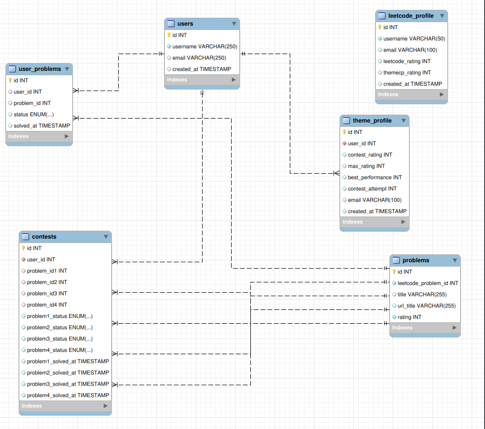

# data required

--> will decide marking scheme at the end.

// skip this for now
1. problem solved, problem number 
2. {
    userName,
    maxRating,
    profilePic
}

roadmap
1. deploy a static, portfolio type website => done
2. get domain name => can get subdomain for gree
3. deploy a web app with react code
4. deplay a web app with some sql data base, like a todo list app
5. understand authentication and browser cookie.

7. there can be cases where for the selected level 
theme is not able to find any question from the db

done 8. change the whole ui with login logout

9. make the whole logic for adding the profile and how to connect with the data base

10. explore createBrowserRouter.

11. whenever the react component get rerendered, useState preserve its data but when the whole page
get refreshed every useState loose its info, to optimize it
later we can store that info in localStorage

12. authentication login-logout logic has got bit messy, resolve it

13. make the contest history (for now leave the profile add logic, this will be the last thing i will do)
    => contest history data base and how it will connect with other tables
    => retrieving the data from the table and showing in the contest history
    => rating increase logic
    => showing the histogram

14. use the leetcode profile name just to get the submission detail. everything related to identity will be related with user_id and email.

15. set update status on both the running contest and contest history page. everytimme the user press this button, the program is gonna look all the recent submission then its gonna update the user_problem table => this table is just gonna store the user-problem pair that has beed solved and the time at which those where solved
and there will be one trigger which will update the problem status in the contest whenever new row get added in the user-problem.

16. code is getting bit messy, now need to include middle ware

17. associate the leetcode profile with the email.

18. before addding the leetcode profile in the users table first check if its valid or not

19. accepted problem is not apprearing

20. during the start of contest theres some bug in refresh submission button
21. make a col on contest which tells if the contest is running or finished
for finished theres only two cases => either all the problems are solved or time finished

## ER diagram of the current database

